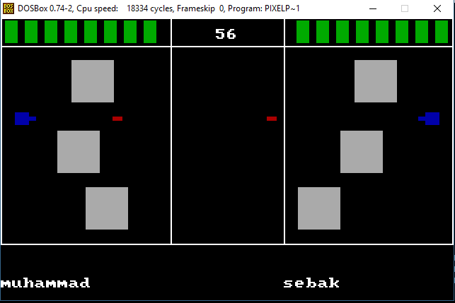

# Pixel Shooter
A simple two-player atari game fully coded with x86 16-bit assembly.  
Developed for the Microprocessor course in the college.

## Description
The purpose of the game is to either kill the enemy, or to survive with more health than the enemy before the time ends (60 seconds). 
The health bar of each player is at the top right and left corners of the screen. 
At the top centre, the timer is shown. Each player shoots red bullets, which are relatively faster than the player's movement. 
If the bullet hits the enemy player, his health decreases (1 rectangle from the health bar is removed). 
Each player can move freely across his area. However, he cannot pass the Trench, or walk though the obstacles. 
Obstacles can be destroyed by shooting at them several times. Obstacles have their own health that decreases by each hit.

## Game Versions
### Phase 1 Version
The game is played on one computer, each player has different controls, the left player moves with `w`-`a`-`s`-`d` and shoots with `q`.  
The second player moves with the keyboard arrows and shoots with `/`, ofcourse the controls can be changed from the code by changing
the scan code of each button.

### Final Version
The game is played on two distinct computes connected with serial port or with ethernet cable.  
This version supports 2 levels of playing and it also support chatting.  

## Download
[Phase 1 Version](https://github.com/muhammad-sayed-mahdy/PixelShooter/blob/master/phase%201/pixel.exe),
[Final Version](https://github.com/muhammad-sayed-mahdy/PixelShooter/blob/master/final%20version/pixels.exe).  
You can run the game using [DOSBox](https://www.dosbox.com) on newer versions of windows,  
because the game uses 16-bit registers which is deprecated for newer versions of windows.   
to run the game correctly, make cpu speed on DOSBox at least 16000 cycles.  
You can run the final version of the game on the same PC or on two distinct PCs.  
### Run the game on the same PC:  
1. Write on DOSBox options `serial1 = directserial realport:COM1`, save it, then open DOSBox.  
2. Write on DOSBox options `serial1 = directserial realport:COM2`, save it, and open a new DOSBox window.
3. You now have two windows like if they were opend on two distinct PCs.

### Run the game on two distinct PCs:
1. Connect the two PCs by using ethernet cable.
2. On the first PC write on DOSBox Options: `serial1=nullmodem port:23`
3. On the second PC write on DOSBox Options: `serial1=nullmodem server:<IPv4 PC1> port:23`
4. To know the IPv4 of the first PC, use this [link](https://www.wikihow.com/Find-the-IP-Address-of-Your-PC?fbclid=IwAR2bSfj4reVqWoOLOL9beuLEwS30Gb0hfRkJypHsDVgNoZyjoYk6ZlwmwDE)
